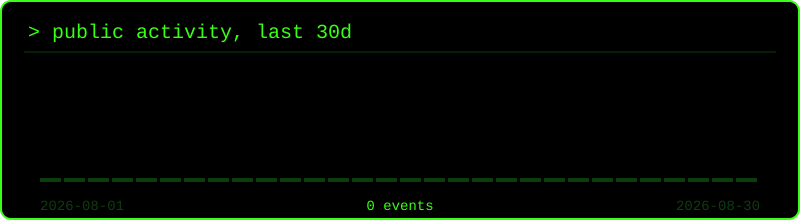
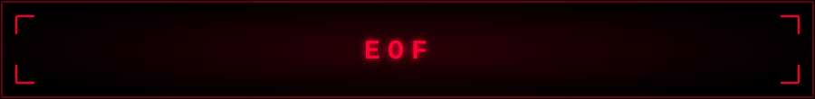

<div align="center">


</div>

<br>

```bash
$ cat about.txt
```

```
> name        : Void
> location    : London, UK
> role        : Computer Science Student
> objective   : Cybersecurity Engineer
> currently   : writing Python tools & learning to break/secure systems
> fun_fact    : my terminal has seen more of me than my webcam has
```

<br>

```bash
$ skillicons --list
```

<div align="center">


<br><br>

`Networking fundamentals` · `Linux internals` · `Offensive & defensive security`
<sub>↳ currently exploring</sub>

</div>

<br>

```bash
$ ./featured_project.sh
```

<div align="center">

### 🛠️ Void-Tools
**Owner** — a growing collection of Python tools.
More details coming as the repo goes public.

</div>

<br>

```bash
$ git log --stats --author=void4code
```

<div align="center">


<br><br>


</div>

<sub>↳ self-hosted: rendered by a workflow in this repo straight from the GitHub API, no third-party dashboard to go down</sub>

<br>

```bash
$ ./activity_graph.sh --range 30d
```

<div align="center">



</div>

<br>

```bash
$ echo "root@void4code:~$ exit"
```

<div align="center">

*compiling knowledge, one exploit at a time.*



</div>
